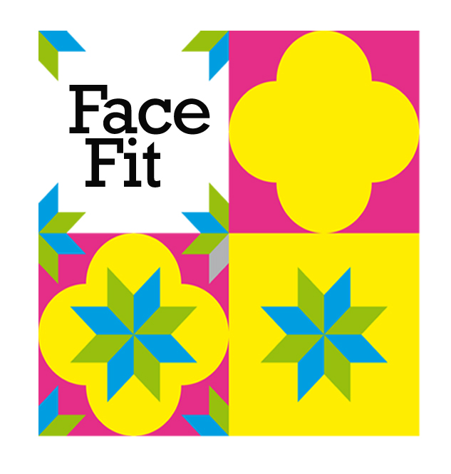

# ReInHerit Face-fit

This application is part of the **ReInHerit Toolkit**.



**Gamification** is the process of exploiting strategies and game dynamics into scenarios that are not a game. 
It has already been proved to be useful to enhance skills and competences in a variety of domains such as marketing, industry training and entertainment.
Also cultural heritage can benefit from a gamification approach which represents an opportunity to **engage visitors** to museums contents through the design of more entertaining, social and challenging digital learning scenarios, to help museums to move from the traditional “look and do not touch” toward a “play and interact” approach. 

Face-fit asks the user to replicate an artwork, concentrating on facial expressions that require a much more refined matching.
The application asks the users to replicate the pose of the head and the expression of some portraits by famous painters and transfer the face of the user on the artworks, generating a new image.
Face-fit can be used on mobile devices and in installations.

This app won a Best Demo Honorable Mention award at ACM Multimedia 2022, the foremost conference on multimedia.


## System set-up
The app is available in two versions: one as desktop app, useful for installations,
and one as web app, useful for mobile devices.

- [Desktop app](#faceFit_Python)
- [Web app](#faceFit_javascript)

The most up-to-date version of the code is in the v2.0 branch and Web-based.

Each subdirectory contains a README.md that describes how to install it.

## Citation

If you use this software in your work please cite:

```
@inproceedings{acmmm-22,
	author = {Donadio, Maria Giovanna and Principi, Filippo and Ferracani, Andrea and Bertini, Marco and Del Bimbo, Alberto},
	booktitle = {Proc. of ACM International Conference on Multimedia (ACM MM)},
	doi = {10.1145/3503161.3547744},
	isbn = {9781450392037},
	keywords = {gamification, face pose, cultural heritage, body pose},
	location = {Lisboa, Portugal},
	numpages = {3},
	pages = {7000--7002},
	publisher = {Association for Computing Machinery},
	series = {MM '22},
	title = {Engaging Museum Visitors with Gamification of Body and Facial Expressions},
	url = {https://doi.org/10.1145/3503161.3547744},
	year = {2022},
	bdsk-url-1 = {https://doi.org/10.1145/3503161.3547744}
}
```


## Acknowledgements
This work was partially supported by the European Commission under European Horizon 2020 Programme, grant number 101004545 - [ReInHerit](https://www.reinherit.eu).

